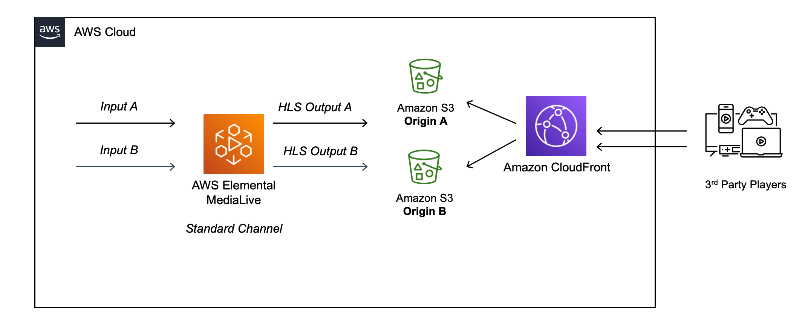
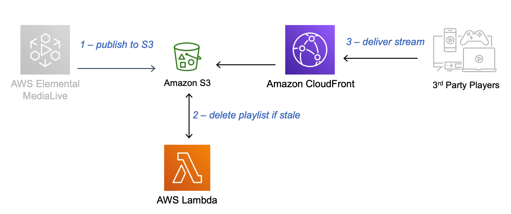

# S3 for Live Video Streaming - Stale Manifest Invalidation

<em> Background is available at this AWS Media blog [Live Video streaming using Amazon S3](https://aws.amazon.com/blogs/media/live-video-streaming-using-amazon-s3/) </em>

## Purpose

When an encoder fails to upload an update to the media playlist, its often times preferable to have this object return a 404 when it is considered stale. A stale playlist contains only segments that are behind the live edge and thus may require a playback switch to a different quality tier or media path altogether. By returning a 404, the client playback device is able to make a switching decision in an attempt to continue playback rather than getting stuck on the stale playlist. 

This reference implementation once deployed will monitor any HLS playlist files uploaded to the nominated S3 bucket and delete when and if a stale variant playlist is detected without #EXT-X-ENDLIST tag.

This project contains source code and supporting files for a serverless application that you can deploy with the SAM CLI. 


## Architecture

### This project is intended for education purposes only and not for production usage.

A redundant Live streaming architecture with AWS Elemental MediaLive standard channel, provides two pipelines of media processing and two identical outputs. In this example, each output is HLS format to a separate S3 bucket, using the Redundant HLS manifests (https://docs.aws.amazon.com/medialive/latest/ug/hls-redundant-manifests.html) feature. Alternatively, with MediaLive single pipeline class, there is only one output destination and any interruption will impact video experience. 

For either modes, any failure to update manifest and segments will result in the live stream going “stale” whereby Players will receive 200 HTTP code responses from the origin, but typically play the last few segments of Video/Audio and then stop. This code will detect stale variant playlists to force 404 HTTP error codes to the downstream Amazon CloudFront CDN and Players, which triggers redundancy failover as described in the HLS specification.




This SAM application deploys the following services:

1. Amazon S3 bucket - for Live encoder to post media and manifests
1. AWS Lambda - to run python code that checks for stale HLS playlists 
1. Amazon CloudFront - distribution to stream to 3rd party HLS players




## Deploy the sample application

The Serverless Application Model Command Line Interface (SAM CLI) is an extension of the AWS CLI that adds functionality for building and testing Lambda applications. It uses Docker to run your functions in an Amazon Linux environment that matches Lambda. It can also emulate your application's build environment and API.

To use the SAM CLI, you need the following tools.

* SAM CLI - [Install the SAM CLI](https://docs.aws.amazon.com/serverless-application-model/latest/developerguide/serverless-sam-cli-install.html)
* [Python 3 installed](https://www.python.org/downloads/)
* Docker - [Install Docker community edition](https://hub.docker.com/search/?type=edition&offering=community)

To build and deploy your application for the first time, run the following in your shell:

```bash
sam build --use-container
sam deploy --guided
```

The first command will build the source of your application. The second command will package and deploy your application to AWS, with a series of prompts:

* **Stack Name**: The name of the stack to deploy to CloudFormation. This should be unique to your account and region, and a good starting point would be something matching your project name.
* **AWS Region**: The AWS region you want to deploy your app to.
* **Confirm changes before deploy**: If set to yes, any change sets will be shown to you before execution for manual review. If set to no, the AWS SAM CLI will automatically deploy application changes.
* **Allow SAM CLI IAM role creation**: Many AWS SAM templates, including this example, create AWS IAM roles required for the AWS Lambda function(s) included to access AWS services. By default, these are scoped down to minimum required permissions. To deploy an AWS CloudFormation stack which creates or modifies IAM roles, the `CAPABILITY_IAM` value for `capabilities` must be provided. If permission isn't provided through this prompt, to deploy this example you must explicitly pass `--capabilities CAPABILITY_IAM` to the `sam deploy` command.
* **Save arguments to samconfig.toml**: If set to yes, your choices will be saved to a configuration file inside the project, so that in the future you can just re-run `sam deploy` without parameters to deploy changes to your application.

You can find your API Gateway Endpoint URL in the output values displayed after deployment.

## Use the SAM CLI to build and test locally

Build your application with the `sam build --use-container` command.

```bash
LiveVideoOrigination$ sam build --use-container
```

The SAM CLI installs dependencies defined in `hello_world/requirements.txt`, creates a deployment package, and saves it in the `.aws-sam/build` folder.

Test a single function by invoking it directly with a test event. An event is a JSON document that represents the input that the function receives from the event source. Test events are included in the `events` folder in this project.

Run functions locally and invoke them with the `sam local invoke` command.

```bash
LiveVideoOrigination$ sam local invoke HelloWorldFunction --event events/event.json
```


## Fetch, tail, and filter Lambda function logs

To simplify troubleshooting, SAM CLI has a command called `sam logs`. `sam logs` lets you fetch logs generated by your deployed Lambda function from the command line. In addition to printing the logs on the terminal, this command has several nifty features to help you quickly find the bug.

`NOTE`: This command works for all AWS Lambda functions; not just the ones you deploy using SAM.

```bash
LiveVideoOrigination$ sam logs -n HelloWorldFunction --stack-name LiveVideoOrigination --tail
```

You can find more information and examples about filtering Lambda function logs in the [SAM CLI Documentation](https://docs.aws.amazon.com/serverless-application-model/latest/developerguide/serverless-sam-cli-logging.html).

## Tests

Tests are defined in the `tests` folder in this project. Use PIP to install the test dependencies and run tests.

```bash
LiveVideoOrigination$ pip install -r tests/requirements.txt --user
# unit test
LiveVideoOrigination$ python -m pytest tests/unit -v
# integration test, requiring deploying the stack first.
# Create the env variable AWS_SAM_STACK_NAME with the name of the stack we are testing
LiveVideoOrigination$ AWS_SAM_STACK_NAME=<stack-name> python -m pytest tests/integration -v
```

## Cleanup

To delete the sample application that you created, use the AWS CLI. Assuming you used your project name for the stack name, you can run the following:

```bash
aws cloudformation delete-stack --stack-name LiveVideoOrigination
```

## Resources

See the [AWS SAM developer guide](https://docs.aws.amazon.com/serverless-application-model/latest/developerguide/what-is-sam.html) for an introduction to SAM specification, the SAM CLI, and serverless application concepts.

Next, you can use AWS Serverless Application Repository to deploy ready to use Apps that go beyond hello world samples and learn how authors developed their applications: [AWS Serverless Application Repository main page](https://aws.amazon.com/serverless/serverlessrepo/)


# Dependencies

      Description: "https://github.com/globocom/m3u8"
      LayerName: m3u8Parse
      LicenseInfo: licensed under the MIT License

# Security
See CONTRIBUTING for more information.

# License
This library is licensed under the MIT-0 License. See the LICENSE file.
